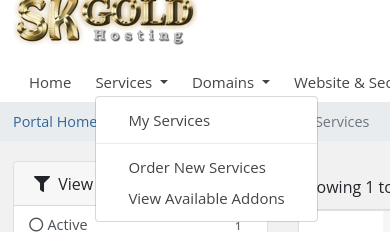
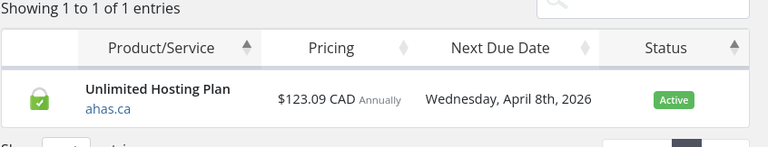
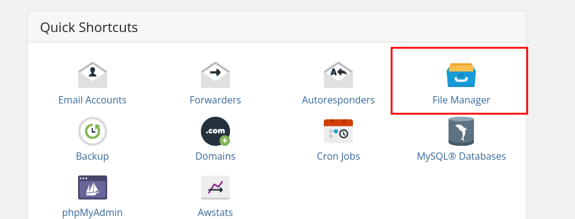

:::tip[If you're unsure]
Make sure to ask me if you're unsure about anything here so I can clarify.  These are important and could break the production site if done incorrectly
:::

## Building the frontend

After making your changes and commiting to github.  run the command 
```bash
npm run build
```
this will build the projects static files to ./project/dist

## Compress the dist folder

You can either use the terminal to compress the dist folder:
#### Mac/Linux
```zsh
zip -vr dist.zip dist/ -x "*.DS_Store"
```
or any gui file explorers by right clicking dist and selecting `compress` > `compress to zip`

## Upload file to cpanel

Head to skgold client portal and login [Here](https://skgold.support/index.php) 

Go to the nav > Services > My Services
 
Click on the Unlimited Hosting Plan
 
Scroll down to File Manager
 

## Upload dist
1. Find the folder staging.ahas.ca and go into it.
2. Upload the zipped folder from the previous step by clicking upload in the toolbar
:::caution
Make sure you're uploading to the correct folder! If not it could break the existing site.
:::
:::note
A better way to do the next steps should be found
:::
3. Click on dist.zip and in the toolbar select `Extract`
4. Move the new files in the dist folder up into the staging.ahas.ca/dist/ to staging.ahas.ca/ by clicking the dist folder and selecting move from the toolbar, and removing the dist/ from the path.
